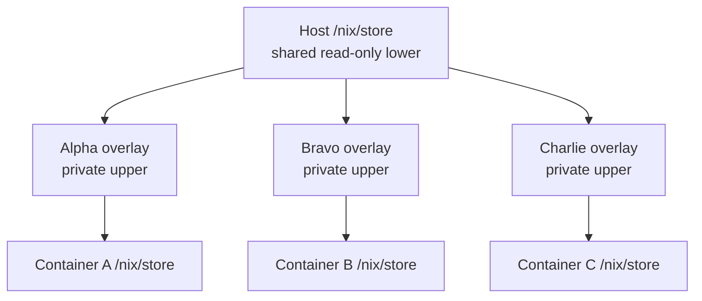

# Upper/lower Nix store

This mode is for running many Nix-based containers without storing and fetching
the same package content for every instance. A large host `/nix/store` becomes
the shared package cache; each container stores only paths and state unique to
it. When Home Manager profiles are built at runtime instead of baked into the
image, the images can remain small while still starting from a heavily
pre-populated package set.

In short: one shared lower store holds the bulk of the packages, while many
small upper stores provide independent writable containers.

The host constructs the OverlayFS mount and gives the container its merged
view. Mounting OverlayFS inside the container would require the broad
`CAP_SYS_ADMIN` capability. This design keeps that capability out of the
container: it never invokes `mount` or manages OverlayFS.

The host's `/nix/store` becomes a shared, read-only lower store. Each container
has a private upper store containing only instance-specific paths and metadata.



Because Nix store paths are immutable and content-addressed, many containers
can reuse one physical copy of common packages. Paths already present in the
lower store need not be downloaded or copied into each container's upper.

## Lightweight images

If the host store contains the packages required by the Home Manager profiles,
the image does not need to embed those profile closures. Disable profile builds
in `nix/default.nix`:

```nix
hmPolicy = {
  buildProfiles = false;
  activateOnBoot = true;
  rebuildOnBoot = true;
};
```

Profiles are then built when the container boots. Their generations remain
private, while package paths can come from the shared lower store. Pre-populate
and retain the desired packages in the host store: paths fetched by one
container enter only its private upper store.

## Enable the overlay store

Set `localOverlayStore` in the `image.nix` call in `nix/default.nix`:

```nix
import ../lib/image.nix {
  # Existing image arguments...
  localOverlayStore = "filesystem";
}
```

| `localOverlayStore` | Fixed contract at `/lower-store` |
| --- | --- |
| `"filesystem"` | The host's `/nix` mounted read-only at `/lower-store/nix` |
| `"socket"` | A Nix daemon socket at `/lower-store/socket` |

Both modes require a host-created OverlayFS mount at `/nix/store`, a private
upper directory, and a private `/nix` volume. At boot, the entrypoint validates
the overlay and the selected `/lower-store` contract. Omit the setting to use an
ordinary private store.

The entrypoint computes the Nix store bootstrap diff by comparing the image's
store-path manifest with the private Nix database first, then batch-querying the
selected lower metadata source for only the remaining paths. Those metadata
sources are authoritative; boot does not probe or enumerate the lower store
filesystem.

## Prepare an instance on the host

Each instance needs distinct upper, work, and merged directories. Its upper and
work directories must be on the same filesystem.

```sh
sudo mkdir -p \
  /var/lib/nix-container/alpha/upper \
  /var/lib/nix-container/alpha/work \
  /var/lib/nix-container/alpha/merged

sudo mount -t overlay overlay \
  -o lowerdir=/nix/store,upperdir=/var/lib/nix-container/alpha/upper,workdir=/var/lib/nix-container/alpha/work \
  /var/lib/nix-container/alpha/merged
```

This command runs on the host before the container starts.

## Run the container

```sh
docker run --detach \
  --name alpha \
  --mount type=bind,source=/var/lib/nix-container/alpha/merged,target=/nix/store \
  --mount type=bind,source=/nix,target=/lower-store/nix,readonly \
  --volume alpha-data:/data \
  --volume alpha-nix:/nix \
  system-image:latest
```

For another instance, reuse `lowerdir=/nix/store` but create new upper, work,
and merged directories and new `/data` and `/nix` volumes.

## Use a socket lower store

With `localOverlayStore = "socket"`, lower-store metadata comes from a Nix
daemon socket while OverlayFS supplies the files. For example, with
[Snix](https://snix.dev/docs/guides/local-overlay/):

```sh
snix store daemon &
snix store mount /var/lib/snix/store &
snix nix-daemon -l /run/snix/socket --unix-listen-unlink &
```

The image closure is separate at `/nix-base/store`. At boot the entrypoint
queries the daemon once for the image paths not already represented by the
private store, copies the missing paths into `/nix/store`, and loads their
registration. It does not list the lower store, so `--list-root` is unnecessary.

Create each instance's overlay with the mounted store as the lower directory:

```sh
sudo mount -t overlay overlay \
  -o lowerdir=/var/lib/snix/store,upperdir=/var/lib/nix-container/alpha/upper,workdir=/var/lib/nix-container/alpha/work \
  /var/lib/nix-container/alpha/merged
```

Run the container as above, replacing the `/lower-store/nix` mount with the
socket's parent directory:

```sh
--mount type=bind,source=/run/snix,target=/lower-store,readonly
```

Mounting the directory lets a restarted daemon replace its socket. The daemon
and mounted files must describe the same immutable lower store.

## Lifecycle constraints

An instance's OverlayFS upper directory and `/nix` volume are two halves of the
same persistent Nix state. The upper directory contains its private store
files; the volume contains the Nix database and profiles that refer to the
combined lower and upper stores. Give both to exactly one instance, and back
up, restore, migrate, or remove them together. Never share either half or pair
it with state from another instance. When switching from an ordinary store to
an overlay store, start with a fresh upper directory, work directory, and
`/nix` volume.

The lower store may grow while containers run, but existing paths and metadata
must not change or disappear. Keep shared paths rooted and coordinate host
garbage collection with container lifetimes.

See the upstream
[Nix local overlay store documentation](https://nix.dev/manual/nix/stable/store/types/experimental-local-overlay-store)
for the underlying constraints.
